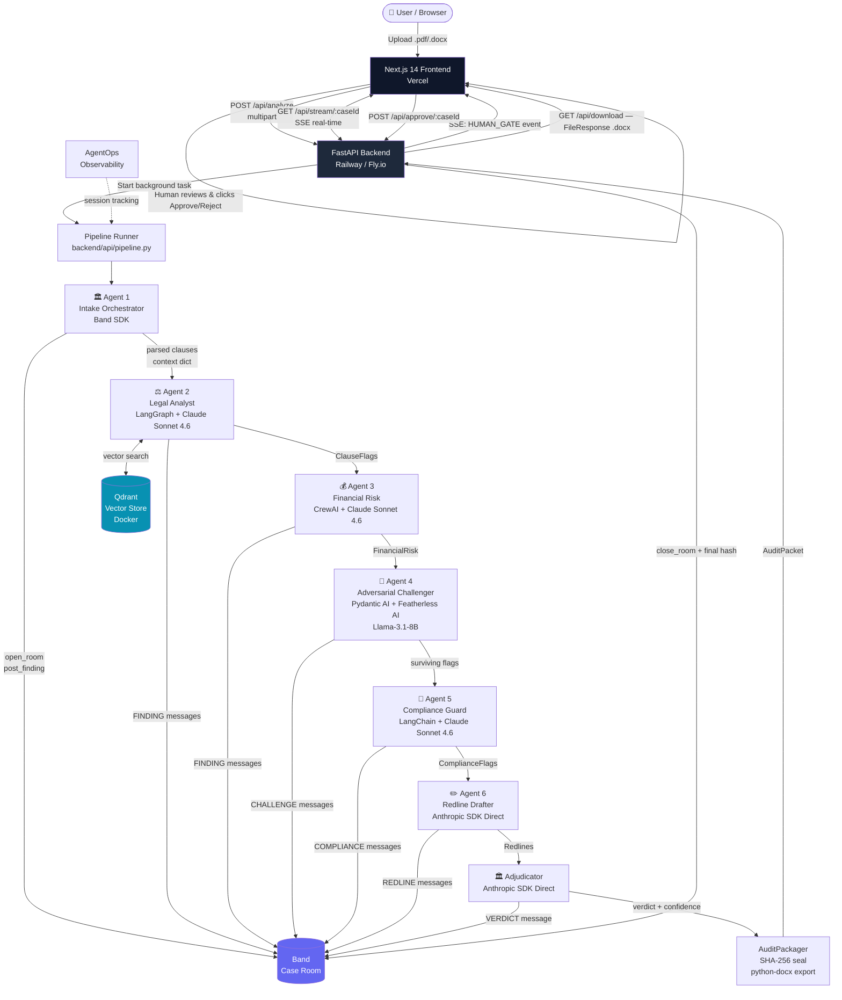

# VerdictFlow — Master Build Prompt & Team Plan
### Band of Agents Hackathon · June 16–19, 2026

---

> **How to use this document:**  
> Paste the entire contents of any Phase section directly into Antigravity IDE as your build prompt. Each phase is self-contained and can be given to the IDE independently. The Team Division section at the end maps every phase and task to a specific teammate.

---

> ⚠️ **DOCUMENT VERSION: ENHANCED v2**  
> This version has been audited and completed. See the **ERRATA** section (after Team Division) for corrections to specific phases, and the **ADDENDA A–H** sections for critical missing pieces: architecture diagram, missing files, library compatibility notes, Band SDK fallback, timeout/retry patterns, Featherless AI auth fix, hackathon prize track checklist, and pre-demo runbook.  
> **Read the ERRATA before running any phase in Antigravity.**

---

## PROJECT OVERVIEW (paste this as the system context before every phase)

```
You are a senior full-stack AI engineer building "VerdictFlow" — a multi-agent contract
intelligence system for the Band of Agents Hackathon. The system uses 6 specialized AI
agents coordinated through a Band shared case room to review, red-team, and redline
enterprise contracts. The output is a human-gated, tamper-evident audit packet.

Tech stack:
- Backend: Python 3.11, FastAPI, uvicorn, SSE (Server-Sent Events)
- Frontend: Next.js 14 (App Router), TypeScript, TailwindCSS
- Agent Frameworks: Band SDK, LangGraph, CrewAI, Pydantic AI, LangChain
- Models: Claude Sonnet 4.6 (Anthropic AI/ML API), Featherless AI (open-source),
  GPT-4o (optional for Financial Risk)
- Vector Store: Qdrant (local Docker instance)
- Document Processing: PyMuPDF (fitz), python-docx
- Observability: AgentOps
- Deployment: Vercel (frontend), Railway or Fly.io (backend)

Repository structure:
verdictflow/
  backend/
    agents/           # one file per agent
    band/             # Band SDK integration
    core/             # contract parser, chunker, vector store
    api/              # FastAPI routes
    models/           # Pydantic schemas
    utils/            # helpers
  frontend/
    app/              # Next.js App Router pages
    components/       # React components
    lib/              # API client, SSE hook
  contracts/          # sample contracts for testing
  docs/               # architecture notes

Environment variables (always reference by name, never hardcode):
  ANTHROPIC_API_KEY, BAND_API_KEY, BAND_WORKSPACE_ID, FEATHERLESS_API_KEY,
  OPENAI_API_KEY (optional), QDRANT_URL, QDRANT_API_KEY, AGENTOPS_API_KEY
```

---

## PHASE 0 — Repository Scaffold & Environment Setup

### Prompt for Antigravity IDE:

```
Using the project overview above, scaffold the complete VerdictFlow repository.

Tasks:
1. Create the full directory tree as specified in the project overview. Add a
   .gitkeep in every empty leaf directory.

2. Create backend/requirements.txt with pinned versions for:
   fastapi==0.111.0, uvicorn[standard]==0.29.0, python-dotenv==1.0.1,
   pydantic==2.7.1, pydantic-settings==2.2.1, anthropic==0.26.0,
   langchain==0.2.1, langchain-openai==0.1.7, langchain-anthropic==0.1.13,
   langgraph==0.1.1, crewai==0.28.0, pydantic-ai==0.0.7,
   qdrant-client==1.9.1, pymupdf==1.24.3, python-docx==1.1.0,
   agentops==0.2.2, httpx==0.27.0, sse-starlette==2.1.0, aiofiles==23.2.1,
   python-multipart==0.0.9

3. Create frontend/package.json with:
   next@14.2.3, react@18.3.1, react-dom@18.3.1, typescript@5.4.5,
   tailwindcss@3.4.3, @types/react@18.3.1, eventsource-parser@1.1.2,
   lucide-react@0.383.0, shadcn/ui (init separately)

4. Create a root .env.example file listing every environment variable from the
   project overview with placeholder values and a comment explaining each one.

5. Create backend/models/schemas.py defining these Pydantic models:
   - ContractUpload: filename (str), content_base64 (str), contract_type
     (Literal["NDA","MSA","SaaS","Employment","Other"])
   - ClauseFlag: clause_id (str), clause_text (str), risk_level
     (Literal["HIGH","MEDIUM","LOW"]), reason (str), agent_id (str),
     band_message_id (str), confidence (float 0–1)
   - FinancialRisk: total_exposure_usd (float), liability_cap_usd (Optional[float]),
     penalty_clauses (list[str]), payment_terms_days (int)
   - ComplianceFlag: regulation (str), article (str), violation_description (str),
     severity (Literal["CRITICAL","MAJOR","MINOR"])
   - Redline: original_clause (str), suggested_clause (str), rationale (str),
     clause_id (str)
   - AuditPacket: case_id (str), contract_filename (str), created_at (datetime),
     clause_flags (list[ClauseFlag]), financial_risk (FinancialRisk),
     compliance_flags (list[ComplianceFlag]), redlines (list[Redline]),
     verdict (str), confidence_score (float), sha256_hash (str),
     band_room_url (str), human_approved (bool)
   - AgentMessage: agent_id (str), agent_name (str), message_type
     (Literal["FINDING","CHALLENGE","COMPLIANCE","REDLINE","VERDICT"]),
     content (str), timestamp (datetime), evidence (list[str])

6. Create backend/core/config.py using pydantic-settings BaseSettings to load
   all environment variables. Fail fast with a clear error if any required var
   is missing.

7. Create a docker-compose.yml at the root with a single service: qdrant using
   image qdrant/qdrant:v1.9.2, port 6333:6333, volume ./qdrant_data:/qdrant/storage.

8. Create a Makefile at the root with targets:
   - install: pip install -r backend/requirements.txt && cd frontend && npm install
   - dev-backend: uvicorn backend.api.main:app --reload --port 8000
   - dev-frontend: cd frontend && npm run dev
   - dev-qdrant: docker-compose up -d
   - test: pytest backend/tests/ -v

9. Create README.md with: project description, one-command setup instructions,
   environment variable table, and a "How to demo" section.

All files must be complete and runnable. No TODO placeholders.
```

---

## PHASE 1 — Contract Parser & Vector Store

### Prompt for Antigravity IDE:

```
Using the project overview and the schemas from Phase 0, build the contract
parsing and vector store layer.

File: backend/core/contract_parser.py

Build a ContractParser class with these methods:

1. parse(file_bytes: bytes, filename: str) -> dict
   - Detect file type from filename extension (.pdf or .docx)
   - For PDF: use PyMuPDF (fitz). Open with fitz.open(stream=file_bytes, filetype="pdf").
     Extract text page by page. Preserve page numbers.
   - For DOCX: use python-docx. Extract paragraph text. Preserve heading structure.
   - Return: {"full_text": str, "pages": list[dict with page_num and text],
     "metadata": {"filename", "page_count", "word_count", "char_count"}}

2. chunk_into_clauses(parsed: dict) -> list[dict]
   - Split the full text into logical clauses using this heuristic:
     Split on patterns that look like clause headings:
     regex: r'(?m)^(\d+\.[\d\.]*\s+[A-Z][^.\n]{3,60}|[A-Z][A-Z\s]{4,40})\s*\n'
   - Each chunk: {"clause_id": "clause_001" (zero-padded), "heading": str,
     "text": str, "char_count": int, "page_ref": int or None}
   - If no headings found, fall back to splitting every 800 characters at
     sentence boundaries (split on ". " or ".\n").
   - Minimum clause length: 50 characters. Merge shorter ones with previous.
   - Return list of clause dicts, minimum 3 clauses even for short contracts.

3. detect_contract_type(full_text: str) -> str
   - Keyword heuristics:
     NDA: ["non-disclosure", "confidential information", "proprietary"]
     MSA: ["master service", "statement of work", "deliverables"]
     SaaS: ["software as a service", "subscription", "uptime", "SLA"]
     Employment: ["employee", "salary", "termination", "at-will"]
   - Return the matching type or "Other"

File: backend/core/vector_store.py

Build a VectorStore class wrapping qdrant-client:

1. __init__: connect to Qdrant at QDRANT_URL. Create collection "precedents"
   if it doesn't exist. Vector size: 1536 (OpenAI embedding dimension).
   Distance: Cosine.

2. embed_text(text: str) -> list[float]
   - Use Anthropic's embeddings if available, otherwise use a lightweight
     sentence-transformers model loaded locally: "all-MiniLM-L6-v2" via
     the sentence-transformers library. Add sentence-transformers==2.7.0
     to requirements.txt.
   - Cache embeddings in a local dict keyed by sha256(text) to avoid
     re-embedding.

3. upsert_precedents(precedents: list[dict])
   - Each precedent: {"id": str, "clause_type": str, "standard_text": str,
     "risk_notes": str, "regulation": str or None}
   - Embed the standard_text. Upsert into Qdrant with full metadata as payload.

4. search_similar(clause_text: str, top_k: int = 5) -> list[dict]
   - Embed the clause_text. Query Qdrant. Return top_k results with their
     payloads and scores.

5. async method: initialize_baseline_library()
   - Hardcode a list of 15 standard clause templates covering:
     NDA mutual confidentiality, NDA one-way, limitation of liability,
     indemnification (standard), indemnification (broad/risky),
     payment terms net-30, payment terms net-60, auto-renewal with notice,
     auto-renewal without notice, IP assignment (employer-friendly),
     IP assignment (contractor-retains), GDPR data processing agreement,
     non-compete (standard), non-solicitation, governing law.
   - Each template must have realistic clause text of 3–5 sentences.
   - Upsert all 15 on initialization. Log "Baseline library loaded: 15 clauses"

File: backend/tests/test_parser.py
   - Write 5 pytest tests covering: PDF parse, DOCX parse, clause chunking,
     contract type detection, and vector search returning ≥1 result.
   - Use a synthetic contract string (no real file needed) for the tests.

All code must be async-compatible, fully typed with type hints, and include
docstrings on every public method.
```

---

## PHASE 2 — Band SDK Integration & Case Room

### Prompt for Antigravity IDE:

```
Using the project overview, build the Band SDK integration layer. This is the
coordination backbone — every agent communicates exclusively through Band.

IMPORTANT: Band SDK documentation is at https://docs.band.ai. The SDK is
installed as "band-sdk" (pip). If the exact SDK API differs from what is
described below, adapt the implementation but preserve the contract
(method signatures and return types must remain identical).

File: backend/band/case_room.py

Build a BandCaseRoom class:

1. __init__(self, config: Settings)
   - Initialize Band client with BAND_API_KEY and BAND_WORKSPACE_ID
   - self.room_id: Optional[str] = None
   - self.room_url: Optional[str] = None

2. async open_room(contract_filename: str, case_id: str) -> str
   - Create a new Band room named f"VerdictFlow | {contract_filename} | {case_id[:8]}"
   - Set room metadata: {"case_id": case_id, "system": "verdictflow",
     "created_at": ISO timestamp}
   - Post an opening message: "📋 Contract case opened. Agents assembling..."
   - Store room_id and room_url. Return room_id.

3. async post_finding(agent_id: str, agent_name: str, message_type: str,
                       content: str, evidence: list[str]) -> str
   - Format message as structured JSON block:
     {"agent": agent_name, "type": message_type, "content": content,
      "evidence": evidence, "timestamp": ISO}
   - Post to Band room. Return the Band message_id.
   - Also write to a local in-memory list self.messages (list[AgentMessage])
     for fast access without re-fetching from Band.

4. async get_all_findings(message_type: Optional[str] = None) -> list[AgentMessage]
   - Return self.messages filtered by message_type if provided.
   - Parse each message's JSON body back into AgentMessage.

5. async post_human_gate_request(verdict: str, confidence: float) -> str
   - Post a formatted summary asking for human approval.
   - Include: verdict text, confidence score, count of HIGH risks,
     count of CRITICAL compliance flags, count of proposed redlines.
   - Tag message with @human for visibility.
   - Return message_id.

6. async close_room(human_approved: bool, audit_hash: str)
   - Post final message: approved/rejected status + SHA-256 hash of audit packet.
   - Archive/close the Band room.

File: backend/band/agent_registry.py

Build an AgentRegistry class:

1. AGENT_MANIFEST: dict — hardcode the 6 agents:
   {"intake_orchestrator": {"name": "Intake & Orchestrator", "framework": "band_sdk",
     "role": "Parse contract, open case room, coordinate all agents"},
    "legal_analyst": {"name": "Legal Analyst", "framework": "langgraph",
     "role": "Flag non-standard clauses, cite precedents"},
    "financial_risk": {"name": "Financial Risk Agent", "framework": "crewai",
     "role": "Quantify monetary exposure and liability"},
    "adversarial_challenger": {"name": "Adversarial Challenger",
     "framework": "pydantic_ai", "role": "Red-team all findings"},
    "compliance_guard": {"name": "Compliance Guard", "framework": "langchain",
     "role": "Cross-check GDPR, CCPA, SOC2"},
    "redline_drafter": {"name": "Redline Drafter", "framework": "anthropic_direct",
     "role": "Rewrite risky clauses with tracked changes"}}

2. get_agent_info(agent_id: str) -> dict — return from manifest.

3. list_active_agents() -> list[str] — return all agent IDs.

File: backend/tests/test_band.py
   - Mock the Band SDK client.
   - Test: room opens and returns a room_id string.
   - Test: post_finding stores message in self.messages.
   - Test: get_all_findings filters by message_type correctly.
   - Test: post_human_gate_request includes verdict text in output.
```

---

## PHASE 3 — Agent 1: Intake & Orchestrator

### Prompt for Antigravity IDE:

```
Build the Intake & Orchestrator agent. This agent is the entry point — it
receives the raw contract, parses it, opens the Band room, and fires all
downstream agents in sequence with proper data passing.

File: backend/agents/intake_orchestrator.py

Build an IntakeOrchestrator class:

1. __init__(self, config: Settings, band_room: BandCaseRoom,
            parser: ContractParser, vector_store: VectorStore)

2. async run(contract_bytes: bytes, filename: str, case_id: str) -> dict
   This is the main orchestration coroutine. Steps:
   a. Call parser.parse(contract_bytes, filename) → parsed_doc
   b. Call parser.chunk_into_clauses(parsed_doc) → clauses (list of dicts)
   c. Call parser.detect_contract_type(parsed_doc["full_text"]) → contract_type
   d. Call band_room.open_room(filename, case_id)
   e. Post to Band: f"📄 Parsed {len(clauses)} clauses from {filename}
      (type: {contract_type}). Dispatching agents..."
   f. Return a context dict:
      {"case_id": case_id, "filename": filename, "contract_type": contract_type,
       "clauses": clauses, "parsed_doc": parsed_doc, "band_room_id": band_room.room_id}

3. The orchestrator does NOT call other agents directly. Instead, the
   FastAPI pipeline layer (Phase 7) calls each agent in sequence, passing
   the context dict. The orchestrator only prepares the context.

File: backend/agents/legal_analyst.py

Build a LegalAnalyst class using LangGraph:

1. __init__(self, config: Settings, band_room: BandCaseRoom,
            vector_store: VectorStore)

2. Build a LangGraph StateGraph with this state schema (TypedDict):
   LegalState: clauses (list[dict]), contract_type (str),
   findings (list[ClauseFlag]), current_clause_idx (int), done (bool)

3. Define these nodes:
   - "analyze_clause": Takes the current clause from state.clauses[state.current_clause_idx].
     Searches vector_store for the top 3 similar precedents.
     Calls Claude Sonnet 4.6 with this prompt:
     """
     You are a senior contract attorney. Analyze this contract clause:

     CLAUSE: {clause_text}

     SIMILAR STANDARD CLAUSES (for comparison):
     {precedents_formatted}

     CONTRACT TYPE: {contract_type}

     Respond ONLY as valid JSON with this exact schema:
     {"risk_level": "HIGH|MEDIUM|LOW", "reason": "max 2 sentences",
      "is_non_standard": true|false, "confidence": 0.0-1.0}

     HIGH = clause significantly deviates from market standard in a way that
     creates legal, financial, or operational risk.
     MEDIUM = clause has unusual terms worth negotiating.
     LOW = clause is standard or minor.
     """
     Parse the JSON response. If risk_level is not LOW, create a ClauseFlag.
   
   - "post_to_band": If current clause produced a ClauseFlag, call
     band_room.post_finding with agent_id="legal_analyst", message_type="FINDING",
     content=the reason, evidence=[clause_text[:200], precedent_ids].
     Store the returned band_message_id in the ClauseFlag.
   
   - "advance": Increment current_clause_idx. If >= len(clauses), set done=True.
   
   - "should_continue": Conditional edge. If done → END, else → "analyze_clause".

4. Compile the graph: START → analyze_clause → post_to_band → advance → should_continue

5. async run(context: dict) -> list[ClauseFlag]
   - Initialize state from context.
   - Invoke the compiled graph with {"recursion_limit": 200}.
   - Return state["findings"].
   - Log: f"Legal Analyst: {len(findings)} flags across {len(clauses)} clauses"

IMPORTANT: Use langchain_anthropic.ChatAnthropic for the LLM call inside the node.
Model: "claude-sonnet-4-6". Temperature: 0.1 for consistent legal analysis.
Always set max_tokens=400 for clause analysis calls to stay within budget.
```

---

## PHASE 4 — Agents 3, 4, 5: Financial Risk, Challenger, Compliance

### Prompt for Antigravity IDE:

```
Build three agents: Financial Risk Agent (CrewAI), Adversarial Challenger
(Pydantic AI), and Compliance Guard (LangChain). These run after the Legal
Analyst and build on its findings.

═══════════════════════════════════════════════════
FILE: backend/agents/financial_risk.py  (CrewAI)
═══════════════════════════════════════════════════

Build a FinancialRiskAgent class using CrewAI:

1. __init__(self, config: Settings, band_room: BandCaseRoom)

2. Build these CrewAI objects:
   
   financial_extractor_agent = Agent(
     role="Contract Financial Analyst",
     goal="Extract all monetary values and payment obligations from contract text",
     backstory="You specialize in contract finance, finding hidden costs and caps.",
     llm=ChatAnthropic(model="claude-sonnet-4-6", temperature=0),
     verbose=False
   )
   
   risk_scorer_agent = Agent(
     role="Financial Risk Scorer",
     goal="Quantify total financial exposure and assign a risk score",
     backstory="You compute worst-case financial scenarios from contract terms.",
     llm=ChatAnthropic(model="claude-sonnet-4-6", temperature=0),
     verbose=False
   )

3. Define two Tasks:
   
   extraction_task = Task(
     description="""
     From this contract text, extract ALL monetary information:
     {contract_text_first_3000_chars}

     Find: payment amounts, liability caps, penalty amounts, payment terms
     (net-30 etc.), auto-renewal costs, early termination fees, SLA credits.
     
     Return ONLY valid JSON:
     {"amounts_found": [{"description": str, "value_usd": float or null,
       "is_capped": bool}], "payment_terms_days": int or null,
      "has_liability_cap": bool, "liability_cap_usd": float or null,
      "has_auto_renewal": bool, "termination_fee_usd": float or null}
     """,
     agent=financial_extractor_agent,
     expected_output="Valid JSON with financial extraction"
   )
   
   scoring_task = Task(
     description="""
     Using the extraction results, calculate total financial exposure.
     Formula: sum all uncapped amounts + (0.2 * capped amounts).
     Identify the top 3 riskiest financial clauses.
     
     Return ONLY valid JSON matching FinancialRisk schema:
     {"total_exposure_usd": float, "liability_cap_usd": float or null,
      "penalty_clauses": [str list of clause descriptions],
      "payment_terms_days": int}
     """,
     agent=risk_scorer_agent,
     expected_output="Valid JSON FinancialRisk object",
     context=[extraction_task]
   )

4. async run(context: dict) -> FinancialRisk
   - Build Crew([financial_extractor_agent, risk_scorer_agent],
                [extraction_task, scoring_task], process=Process.sequential)
   - Pass contract text (first 3000 chars) as input.
   - crew.kickoff({"contract_text_first_3000_chars": context["parsed_doc"]["full_text"][:3000]})
   - Parse the final JSON output into FinancialRisk.
   - Post to Band: f"💰 Financial exposure: ${result.total_exposure_usd:,.0f}"
   - Return FinancialRisk.

═══════════════════════════════════════════════════
FILE: backend/agents/adversarial_challenger.py  (Pydantic AI)
═══════════════════════════════════════════════════

Build an AdversarialChallenger class using Pydantic AI:

1. __init__(self, config: Settings, band_room: BandCaseRoom)

2. Define a Pydantic output model:
   class ChallengeResult(BaseModel):
     clause_id: str
     original_risk_level: str
     upheld: bool  # True if the risk is real, False if challenger wins
     challenge_reasoning: str  # max 3 sentences
     revised_risk_level: Optional[str]  # if upheld=False, what level is fairer
     confidence: float

3. Initialize a pydantic_ai.Agent with:
   - model: Use Featherless AI endpoint. Featherless AI is OpenAI-compatible.
     Base URL: "https://api.featherless.ai/v1"
     Model: "meta-llama/Llama-3.1-8B-Instruct" (or best available on Featherless)
     Use pydantic_ai's OpenAI-compatible provider with custom base_url.
   - result_type: ChallengeResult
   - system_prompt:
     """
     You are a defense attorney for contract clauses. Your job is to argue
     AGAINST risk flags. Be aggressive. If a clause is flagged HIGH risk,
     try hard to show it is actually standard practice and LOW or MEDIUM.
     You succeed when you can cite: market standard, common practice, or
     legal precedent that defends the clause. You fail only when the risk
     is genuinely severe with no defense.
     """

4. async run(context: dict, legal_findings: list[ClauseFlag],
             financial_risk: FinancialRisk) -> list[ClauseFlag]
   
   surviving_flags = []
   
   For each ClauseFlag in legal_findings where risk_level in ["HIGH", "MEDIUM"]:
     - Fetch the original clause text from context["clauses"] by clause_id
     - Run pydantic_ai agent with prompt:
       f"""
       FLAGGED CLAUSE (risk: {flag.risk_level}):
       {clause_text}
       
       ANALYST'S REASON: {flag.reason}
       
       Challenge this. Is this truly {flag.risk_level} risk?
       clause_id must be: {flag.clause_id}
       original_risk_level must be: {flag.risk_level}
       """
     - If result.upheld = True: keep ClauseFlag, post to Band type="CHALLENGE"
       with content=f"✅ Risk UPHELD for {flag.clause_id}: {result.challenge_reasoning}"
     - If result.upheld = False: downgrade or drop the flag. Post to Band
       content=f"❌ Risk DISMISSED for {flag.clause_id}: {result.challenge_reasoning}"
     - Update flag.confidence based on result.confidence
   
   - Also challenge the financial_risk: if total_exposure_usd > 0, run a
     challenge pass specifically asking "Is this exposure figure realistic
     or does it double-count?" Post the result to Band.
   
   - Return only the upheld flags (surviving_flags).
   - Log: f"Challenger dismissed {len(legal_findings) - len(surviving_flags)} flags"

═══════════════════════════════════════════════════
FILE: backend/agents/compliance_guard.py  (LangChain)
═══════════════════════════════════════════════════

Build a ComplianceGuard class using LangChain:

1. __init__(self, config: Settings, band_room: BandCaseRoom)

2. Define a REGULATION_RULES dict (hardcoded):
   {
     "GDPR": [
       {"article": "Art. 13", "trigger_keywords": ["personal data", "data subject",
         "processing"], "description": "Requires disclosure of data processing purposes"},
       {"article": "Art. 17", "trigger_keywords": ["deletion", "erasure", "right to
         be forgotten"], "description": "Right to erasure must be explicitly granted"},
       {"article": "Art. 28", "trigger_keywords": ["processor", "sub-processor",
         "data processing"], "description": "DPA required for processor relationships"},
       {"article": "Art. 46", "trigger_keywords": ["transfer", "third country",
         "international"], "description": "International transfers need safeguards"}
     ],
     "CCPA": [
       {"article": "Sec. 1798.100", "trigger_keywords": ["california", "consumer",
         "personal information"], "description": "CA consumers must have opt-out rights"},
       {"article": "Sec. 1798.140", "trigger_keywords": ["sale", "business purpose",
         "service provider"], "description": "Selling data requires specific disclosures"}
     ],
     "SOC2": [
       {"article": "CC6.1", "trigger_keywords": ["security", "encryption", "access
         control"], "description": "Logical access controls must be specified"},
       {"article": "A1.1", "trigger_keywords": ["availability", "uptime", "SLA",
         "99."], "description": "Availability commitments must match SOC2 Type II"}
     ]
   }

3. Build a LangChain chain:
   - LLM: ChatAnthropic(model="claude-sonnet-4-6", temperature=0)
   - Prompt template with input variables: [clause_text, triggered_rules, contract_type]
   - System: "You are a regulatory compliance officer. Identify compliance violations."
   - Human: """
     CLAUSE: {clause_text}
     POTENTIALLY APPLICABLE RULES: {triggered_rules}
     CONTRACT TYPE: {contract_type}
     
     For each rule that is actually violated, respond as JSON array:
     [{"regulation": str, "article": str, "violation_description": str,
       "severity": "CRITICAL|MAJOR|MINOR"}]
     Return empty array [] if no violations. Return ONLY JSON.
     """
   - OutputParser: JsonOutputParser()

4. async run(context: dict, surviving_flags: list[ClauseFlag]) -> list[ComplianceFlag]
   
   all_violations = []
   full_text = context["parsed_doc"]["full_text"].lower()
   
   For each regulation in REGULATION_RULES:
     For each rule in that regulation:
       If any trigger_keyword appears in full_text:
         - Find the relevant clause(s) from context["clauses"] that contain
           the keyword
         - Run the LangChain chain on each relevant clause
         - Parse JSON output into list[ComplianceFlag]
         - Add to all_violations
   
   - Deduplicate by (regulation, article) — keep highest severity.
   - For each CRITICAL violation, post to Band with message_type="COMPLIANCE",
     content=f"🚨 CRITICAL: {violation.regulation} {violation.article} — {violation.violation_description}"
   - For MAJOR violations, post similarly but with ⚠️ prefix.
   - Return all_violations.
   - If len([v for v in all_violations if v.severity == "CRITICAL"]) > 0:
     Also post a Band message: "🛑 CRITICAL compliance issues found. Human review
     is mandatory before proceeding."

All three agents must be fully async. Use asyncio.to_thread() to wrap any
synchronous LLM calls (CrewAI, older LangChain versions may be sync).
All agents must handle JSON parsing errors gracefully — if the LLM returns
malformed JSON, log the raw output and return an empty result rather than
crashing.
```

---

## PHASE 5 — Agent 6: Redline Drafter + Adjudicator

### Prompt for Antigravity IDE:

```
Build the Redline Drafter (Claude direct API) and the Adjudicator/Verifier.
These are the final two pipeline steps before human review.

═══════════════════════════════════════════════════
FILE: backend/agents/redline_drafter.py
═══════════════════════════════════════════════════

Build a RedlineDrafter class using the Anthropic SDK directly
(not via LangChain — direct SDK for maximum control):

1. __init__(self, config: Settings, band_room: BandCaseRoom)
   - self.client = anthropic.AsyncAnthropic(api_key=config.ANTHROPIC_API_KEY)

2. async _draft_single_redline(clause: dict, flag: ClauseFlag,
                               contract_type: str) -> Optional[Redline]
   
   system_prompt = """
   You are a contract attorney specializing in B2B commercial agreements.
   You will be given a risky contract clause and you must rewrite it to be
   fair and market-standard. Your rewrite must:
   - Preserve the original commercial intent of the clause
   - Remove or limit the identified risk
   - Use plain, clear legal language
   - Be approximately the same length as the original
   - Match the style and formality of the contract type
   
   Respond ONLY as valid JSON:
   {"suggested_clause": "full rewritten clause text here",
    "rationale": "1-2 sentences explaining the key change and why it reduces risk"}
   """
   
   user_prompt = f"""
   CONTRACT TYPE: {contract_type}
   RISK LEVEL: {flag.risk_level}
   RISK REASON: {flag.reason}
   
   ORIGINAL CLAUSE (ID: {clause["clause_id"]}):
   {clause["text"]}
   
   Rewrite this clause to eliminate the identified risk while preserving
   commercial intent.
   """
   
   response = await self.client.messages.create(
     model="claude-sonnet-4-6",
     max_tokens=600,
     system=system_prompt,
     messages=[{"role": "user", "content": user_prompt}]
   )
   
   - Parse JSON from response.content[0].text
   - Return Redline(original_clause=clause["text"], clause_id=flag.clause_id,
                    suggested_clause=parsed["suggested_clause"],
                    rationale=parsed["rationale"])
   - On JSON parse error: log and return None.

3. async run(context: dict, surviving_flags: list[ClauseFlag]) -> list[Redline]
   
   - Only draft redlines for HIGH and MEDIUM risk flags.
   - Run _draft_single_redline for each qualifying flag.
   - Use asyncio.gather(*tasks) to run all drafts in parallel (faster).
   - Filter out None results.
   - For each Redline, post to Band with message_type="REDLINE":
     content=f"✏️ Redline for {redline.clause_id}: {redline.rationale}"
     evidence=[f"Original: {redline.original_clause[:100]}...",
               f"Proposed: {redline.suggested_clause[:100]}..."]
   - Return list of Redlines.
   - Log: f"Redline Drafter: {len(redlines)} redlines drafted"

═══════════════════════════════════════════════════
FILE: backend/agents/adjudicator.py
═══════════════════════════════════════════════════

Build an Adjudicator class. This is the synthesis pass.

1. __init__(self, config: Settings, band_room: BandCaseRoom)
   - self.client = anthropic.AsyncAnthropic(api_key=config.ANTHROPIC_API_KEY)

2. async run(context: dict, clause_flags: list[ClauseFlag],
             financial_risk: FinancialRisk, compliance_flags: list[ComplianceFlag],
             redlines: list[Redline]) -> tuple[str, float]
   
   a. Fetch all Band messages from band_room.get_all_findings() to build
      the full evidence trail.
   
   b. Count metrics:
      high_risks = len([f for f in clause_flags if f.risk_level == "HIGH"])
      critical_compliance = len([c for c in compliance_flags if c.severity == "CRITICAL"])
      redlines_count = len(redlines)
      exposure = financial_risk.total_exposure_usd
   
   c. Build a verification check:
      For each ClauseFlag, verify that band_message_id is a real message_id
      in the Band room messages. If any flag has a band_message_id that
      doesn't exist in band messages, downgrade its confidence by 0.3 and
      add a note "UNVERIFIED" to its reason.
   
   d. Call Claude for the final verdict:
      prompt = f"""
      You are a chief legal counsel issuing a final contract review verdict.
      
      SUMMARY OF FINDINGS:
      - High-risk clauses: {high_risks}
      - Critical compliance issues: {critical_compliance}
      - Proposed redlines: {redlines_count}
      - Total financial exposure: ${exposure:,.0f}
      
      TOP RISKS:
      {chr(10).join([f"- [{f.risk_level}] {f.reason}" for f in clause_flags[:5]])}
      
      COMPLIANCE ISSUES:
      {chr(10).join([f"- {c.regulation} {c.article}: {c.violation_description}"
                     for c in compliance_flags[:3]]) or "None"}
      
      Write a professional 3-paragraph contract review verdict:
      Paragraph 1: Overall risk assessment and recommendation (APPROVE / APPROVE WITH CHANGES / DO NOT SIGN)
      Paragraph 2: Top 3 issues requiring immediate attention
      Paragraph 3: Next steps for the legal team
      
      Be direct. Be specific. Cite the actual numbers above.
      """
      
      response = await self.client.messages.create(
        model="claude-sonnet-4-6", max_tokens=500,
        messages=[{"role": "user", "content": prompt}]
      )
      verdict_text = response.content[0].text
   
   e. Calculate confidence_score:
      base = 0.7
      base += 0.1 if high_risks < 3 else 0
      base += 0.1 if critical_compliance == 0 else 0
      base += 0.1 if len(clause_flags) > 0 else 0  # found something = thorough
      confidence_score = min(base, 1.0)
   
   f. Post verdict to Band with message_type="VERDICT":
      content=verdict_text, evidence=[f"Confidence: {confidence_score:.0%}"]
   
   g. Return (verdict_text, confidence_score)

═══════════════════════════════════════════════════
FILE: backend/core/audit_packager.py
═══════════════════════════════════════════════════

Build an AuditPackager class:

1. async package(case_id: str, filename: str, clause_flags: list[ClauseFlag],
                  financial_risk: FinancialRisk, compliance_flags: list[ComplianceFlag],
                  redlines: list[Redline], verdict: str, confidence: float,
                  band_room_url: str) -> AuditPacket

   a. Create an AuditPacket with all fields populated.
   b. human_approved = False (not yet).
   c. Compute SHA-256 hash:
      content_to_hash = json.dumps({
        "case_id": case_id, "clause_flags": [f.model_dump() for f in clause_flags],
        "financial_risk": financial_risk.model_dump(),
        "compliance_flags": [c.model_dump() for c in compliance_flags],
        "redlines": [r.model_dump() for r in redlines],
        "verdict": verdict
      }, sort_keys=True, default=str)
      sha256_hash = hashlib.sha256(content_to_hash.encode()).hexdigest()
   d. Return AuditPacket with sha256_hash set.

2. async export_docx(packet: AuditPacket, output_path: str)
   Use python-docx to generate a professional audit report DOCX:
   - Title: "VerdictFlow Contract Audit Report"
   - Subtitle: filename + date
   - Section 1: Executive Verdict (the verdict text)
   - Section 2: Financial Risk Summary (table with exposure, cap, payment terms)
   - Section 3: Clause Flags (table: Clause ID | Risk Level | Reason | Confidence)
   - Section 4: Compliance Issues (table: Regulation | Article | Severity | Description)
   - Section 5: Proposed Redlines (for each redline: original text in red strikethrough
     style, proposed text in green — use paragraph runs with explicit color)
   - Footer: SHA-256 hash + "Generated by VerdictFlow" + timestamp
   - Save to output_path.

For the DOCX redline formatting:
  paragraph = document.add_paragraph()
  run_original = paragraph.add_run("ORIGINAL: " + redline.original_clause)
  run_original.font.color.rgb = RGBColor(0xC0, 0x00, 0x00)  # dark red
  run_original.font.strike = True
  paragraph.add_run("\n")
  run_proposed = paragraph.add_run("PROPOSED: " + redline.suggested_clause)
  run_proposed.font.color.rgb = RGBColor(0x00, 0x70, 0x00)  # dark green
```

---

## PHASE 6 — FastAPI Backend & SSE Pipeline

### Prompt for Antigravity IDE:

```
Build the FastAPI backend that wires all agents into a pipeline and streams
live progress to the frontend via Server-Sent Events (SSE).

═══════════════════════════════════════════════════
FILE: backend/api/main.py
═══════════════════════════════════════════════════

Create a FastAPI application:

1. App setup:
   - FastAPI(title="VerdictFlow API", version="1.0.0")
   - CORS middleware: allow origins=["http://localhost:3000",
     "https://verdictflow.vercel.app"], methods=["*"], headers=["*"]
   - AgentOps initialization on startup: agentops.init(api_key=config.AGENTOPS_API_KEY,
     project_name="verdictflow")
   - Lifespan context manager: on startup, initialize vector_store baseline library.
   - Mount /static for the DOCX download endpoint.

2. In-memory case store (for hackathon simplicity — no DB needed):
   cases: dict[str, dict] = {}  # case_id → {packet, status, progress_messages}

3. POST /api/analyze endpoint:
   - Accept: multipart/form-data with field "file" (UploadFile)
   - Validate file is .pdf or .docx. Reject others with 422.
   - Generate case_id = str(uuid4())
   - Initialize cases[case_id] = {"status": "processing", "progress": [], "packet": None}
   - Start the pipeline as a background task (fastapi BackgroundTasks)
   - Return immediately: {"case_id": case_id, "status": "processing"}

4. GET /api/stream/{case_id} endpoint:
   - Returns EventSourceResponse (from sse-starlette)
   - Generator function that:
     a. Polls cases[case_id]["progress"] every 0.5 seconds
     b. Sends new messages as SSE events: data=json.dumps({"message": msg, "type": type})
     c. When cases[case_id]["status"] == "awaiting_human":
        Send event: data=json.dumps({"type": "HUMAN_GATE", "packet": packet_summary})
     d. When status == "complete" or "error": send final event and close.
   - Timeout after 5 minutes.

5. POST /api/approve/{case_id} endpoint:
   - Body: {"approved": bool, "reviewer_notes": str}
   - If approved: set packet.human_approved = True, update status to "complete",
     finalize Band room, return full AuditPacket as JSON.
   - If not approved: set status to "rejected", post Band message with reviewer notes,
     return {"status": "rejected", "notes": reviewer_notes}

6. GET /api/download/{case_id} endpoint:
   - Export the audit packet as DOCX using AuditPackager.export_docx()
   - Return FileResponse with content_type "application/vnd.openxmlformats-officedocument.wordprocessingml.document"
   - Filename: f"verdictflow_audit_{case_id[:8]}.docx"

7. GET /api/health endpoint:
   - Return {"status": "ok", "version": "1.0.0", "qdrant": "connected" or "error"}

═══════════════════════════════════════════════════
FILE: backend/api/pipeline.py
═══════════════════════════════════════════════════

Build the run_pipeline coroutine — this is what the background task calls:

async def run_pipeline(case_id: str, file_bytes: bytes, filename: str,
                       cases: dict, config: Settings):

  def progress(msg: str, msg_type: str = "INFO"):
    cases[case_id]["progress"].append({"message": msg, "type": msg_type,
                                        "timestamp": datetime.utcnow().isoformat()})

  try:
    # Initialize dependencies
    band_room = BandCaseRoom(config)
    parser = ContractParser()
    vector_store = VectorStore(config)
    
    # Phase 1: Intake
    progress("📋 Opening Band case room...", "BAND")
    orchestrator = IntakeOrchestrator(config, band_room, parser, vector_store)
    context = await orchestrator.run(file_bytes, filename, case_id)
    progress(f"✅ Parsed {len(context['clauses'])} clauses", "SUCCESS")
    
    # Phase 2: Legal Analysis
    progress("⚖️ Legal Analyst reviewing clauses...", "AGENT")
    legal = LegalAnalyst(config, band_room, vector_store)
    clause_flags = await legal.run(context)
    progress(f"⚖️ Found {len(clause_flags)} legal flags", "FINDING")
    
    # Phase 3: Financial Risk
    progress("💰 Financial Risk Agent scanning terms...", "AGENT")
    financial = FinancialRiskAgent(config, band_room)
    financial_risk = await financial.run(context)
    progress(f"💰 Exposure: ${financial_risk.total_exposure_usd:,.0f}", "FINDING")
    
    # Phase 4: Adversarial Challenge
    progress("🔴 Adversarial Challenger red-teaming findings...", "AGENT")
    challenger = AdversarialChallenger(config, band_room)
    surviving_flags = await challenger.run(context, clause_flags, financial_risk)
    dismissed = len(clause_flags) - len(surviving_flags)
    progress(f"🔴 Challenger dismissed {dismissed} flags. {len(surviving_flags)} risks confirmed.", "CHALLENGE")
    
    # Phase 5: Compliance
    progress("📜 Compliance Guard checking regulations...", "AGENT")
    compliance = ComplianceGuard(config, band_room)
    compliance_flags = await compliance.run(context, surviving_flags)
    critical = len([c for c in compliance_flags if c.severity == "CRITICAL"])
    progress(f"📜 Found {len(compliance_flags)} compliance issues ({critical} critical)", "COMPLIANCE")
    
    # Phase 6: Redline Drafting
    progress("✏️ Redline Drafter proposing changes...", "AGENT")
    drafter = RedlineDrafter(config, band_room)
    redlines = await drafter.run(context, surviving_flags)
    progress(f"✏️ {len(redlines)} redlines drafted", "REDLINE")
    
    # Phase 7: Adjudication
    progress("🏛️ Adjudicator synthesizing verdict...", "AGENT")
    adjudicator = Adjudicator(config, band_room)
    verdict, confidence = await adjudicator.run(
      context, surviving_flags, financial_risk, compliance_flags, redlines)
    progress(f"🏛️ Verdict ready. Confidence: {confidence:.0%}", "VERDICT")
    
    # Phase 8: Package
    packager = AuditPackager()
    packet = await packager.package(
      case_id=case_id, filename=filename,
      clause_flags=surviving_flags, financial_risk=financial_risk,
      compliance_flags=compliance_flags, redlines=redlines,
      verdict=verdict, confidence=confidence,
      band_room_url=band_room.room_url
    )
    
    # Human gate
    await band_room.post_human_gate_request(verdict, confidence)
    cases[case_id]["packet"] = packet
    cases[case_id]["status"] = "awaiting_human"
    progress("🚦 Awaiting human review...", "HUMAN_GATE")
    
  except Exception as e:
    cases[case_id]["status"] = "error"
    progress(f"❌ Pipeline error: {str(e)}", "ERROR")
    import traceback
    traceback.print_exc()
    raise
```

---

## PHASE 7 — Next.js Frontend

### Prompt for Antigravity IDE:

```
Build the complete Next.js 14 frontend for VerdictFlow. This is the demo
interface that judges will interact with. It must look professional and show
the live agent activity in real time.

Technology: Next.js 14 App Router, TypeScript, TailwindCSS.
Color scheme: dark navy (#0f172a) background, white cards, accent color #6366f1 (indigo).
Font: Inter (Google Fonts).

═══════════════════════════════════════════════════
FILE: frontend/app/layout.tsx
═══════════════════════════════════════════════════

Root layout with:
- Inter font from next/font/google
- Dark background: bg-slate-950
- Meta tags: title "VerdictFlow", description "Multi-agent contract intelligence"
- No navbar (single-page app)

═══════════════════════════════════════════════════
FILE: frontend/app/page.tsx
═══════════════════════════════════════════════════

Single-page app with these sections (conditional rendering based on app state):

App state (React useState):
  phase: "upload" | "processing" | "human_gate" | "complete" | "error"
  caseId: string | null
  progressMessages: {message: string, type: string, timestamp: string}[]
  packet: AuditPacket | null

SECTION 1 — Upload (phase === "upload"):
  - Centered card with:
    - VerdictFlow logo (text logo: "⚖️ VerdictFlow" in large bold white text)
    - Subtitle: "Multi-agent contract intelligence"
    - File drop zone: dashed border, accepts .pdf and .docx
      drag-and-drop + click-to-upload
    - Contract type selector dropdown (NDA, MSA, SaaS, Employment, Other)
    - Large "Analyze Contract" button (indigo, full width)
    - On submit: POST to /api/analyze, get case_id, transition to "processing"

SECTION 2 — Processing (phase === "processing"):
  - Left panel (60%): "Agent Activity Feed" — live SSE stream
    - Connect to GET /api/stream/{caseId}
    - New messages appear at top with slide-down animation
    - Each message has:
      - Icon based on type: ⚖️ AGENT, 🔴 CHALLENGE, 💰 FINDING,
        📜 COMPLIANCE, ✏️ REDLINE, 🏛️ VERDICT, 🚦 HUMAN_GATE
      - Message text in white
      - Timestamp in gray
      - Type badge (color coded)
    - Auto-scroll to latest
  - Right panel (40%): "Case Progress"
    - 6 agent cards (one per agent) with status indicators:
      ⏳ Waiting → 🔄 Running → ✅ Done
    - Update status based on SSE message types received
    - Financial exposure counter (updates when FINDING message arrives)
    - Risk count badge

SECTION 3 — Human Gate (phase === "human_gate"):
  - Show the full AuditPacket summary:
    - Verdict text (large, prominent)
    - Confidence score gauge (circular SVG)
    - Four stat cards: High Risks | Critical Compliance | Redlines | Exposure $
    - Expandable sections for each category (clause flags, compliance, redlines)
    - For redlines: show original (red strikethrough) vs proposed (green) side by side
    - Band Room link button (opens band_room_url in new tab)
    - Two large buttons: "✅ APPROVE & SEAL" and "❌ REJECT & RE-REVIEW"
    - Text area for reviewer notes (required for reject)
    - On approve: POST /api/approve/{caseId} body {approved: true}
    - On reject: POST /api/approve/{caseId} body {approved: false, notes}

SECTION 4 — Complete (phase === "complete"):
  - Success animation (simple CSS checkmark)
  - "Audit packet sealed and signed" message
  - SHA-256 hash display (monospace, truncated)
  - Download button: GET /api/download/{caseId} → downloads DOCX
  - "Analyze Another Contract" button → reset to upload phase
  - Stats summary card

═══════════════════════════════════════════════════
FILE: frontend/lib/api.ts
═══════════════════════════════════════════════════

API client:
  const API_BASE = process.env.NEXT_PUBLIC_API_URL || "http://localhost:8000"

  export async function analyzeContract(file: File): Promise<{case_id: string}>
    - FormData POST to ${API_BASE}/api/analyze
    - Return response JSON

  export function createSSEConnection(caseId: string,
    onMessage: (msg: ProgressMessage) => void,
    onHumanGate: (packet: AuditPacket) => void,
    onError: (err: string) => void): () => void
    - Use eventsource-parser for SSE parsing with fetch (not EventSource — needed
      for custom headers support)
    - Parse each SSE data event as JSON
    - Call onHumanGate when type === "HUMAN_GATE"
    - Return a cleanup function that aborts the fetch

  export async function approveCase(caseId: string, approved: boolean,
    notes?: string): Promise<AuditPacket | {status: string}>

  export async function downloadAudit(caseId: string): Promise<void>
    - Fetch the DOCX, create a Blob URL, trigger download, revoke URL.

═══════════════════════════════════════════════════
FILE: frontend/lib/types.ts
═══════════════════════════════════════════════════

TypeScript interfaces mirroring the Pydantic schemas:
  ClauseFlag, FinancialRisk, ComplianceFlag, Redline, AuditPacket, AgentMessage
  (match field names exactly from backend/models/schemas.py)

Make all components responsive. The judges may view on laptop screens.
Use TailwindCSS only — no additional CSS frameworks or component libraries
beyond what is strictly needed. Keep the design clean and impressive.
```

---

## PHASE 8 — Integration Test, Demo Contracts & Deployment

### Prompt for Antigravity IDE:

```
Final phase: end-to-end integration, sample contracts for the demo, and
deployment configuration.

═══════════════════════════════════════════════════
TASK 1: Sample Contracts
═══════════════════════════════════════════════════

Create contracts/sample_nda.txt containing a realistic 600-word NDA with
these intentional red flags (for demo purposes):
1. A one-sided "PERPETUAL AND IRREVOCABLE" confidentiality clause (no sunset)
2. An extremely broad definition of "Confidential Information" covering
   "all information disclosed in any form"
3. A non-compete clause spanning "2 years globally in any industry"
4. No carve-out for publicly available information
5. Automatic renewal with only 7 days notice to cancel
6. Governing law: "The disclosing party's jurisdiction" (no specific state)
7. No limitation of liability clause

Also create contracts/sample_saas.txt containing a realistic 800-word SaaS
agreement with:
1. Personal data processing with no explicit GDPR DPA reference
2. Liability cap of $100 (extreme low-cap)
3. SLA of "commercially reasonable efforts" (not quantified)
4. Unilateral price increase clause with no cap
5. Broad IP assignment transferring all work product to vendor
6. No data deletion on termination

These contracts will be used during the demo to showcase the system.
Place both files in the contracts/ directory.

═══════════════════════════════════════════════════
TASK 2: Integration Test Script
═══════════════════════════════════════════════════

Create backend/tests/test_integration.py:

An integration test that runs the FULL pipeline on sample_nda.txt:
1. Parse the sample NDA
2. Initialize vector store
3. Run IntakeOrchestrator
4. Run LegalAnalyst — assert at least 3 ClauseFlags returned
5. Run FinancialRiskAgent — assert total_exposure_usd > 0
6. Run AdversarialChallenger — assert it returns fewer flags than input
7. Run ComplianceGuard — assert at least 1 compliance flag returned
8. Run RedlineDrafter — assert at least 2 redlines returned
9. Run Adjudicator — assert verdict contains "DO NOT SIGN" or "APPROVE WITH CHANGES"
10. Run AuditPackager — assert sha256_hash is a valid 64-char hex string
11. Run export_docx — assert the file exists and is > 10KB

Mark this test with @pytest.mark.integration so it only runs when explicitly
requested (not on every CI run). Use real API calls — this test requires
real API keys.

Add a pytest.ini at the root:
[pytest]
markers = integration: marks tests as integration tests (require API keys)
asyncio_mode = auto

═══════════════════════════════════════════════════
TASK 3: Deployment Configuration
═══════════════════════════════════════════════════

Create frontend/vercel.json:
{
  "env": {"NEXT_PUBLIC_API_URL": "@verdictflow_api_url"},
  "buildCommand": "npm run build",
  "outputDirectory": ".next"
}

Create backend/Dockerfile:
FROM python:3.11-slim
WORKDIR /app
COPY requirements.txt .
RUN pip install --no-cache-dir -r requirements.txt
COPY . .
EXPOSE 8000
CMD ["uvicorn", "api.main:app", "--host", "0.0.0.0", "--port", "8000"]

Create backend/railway.toml (for Railway.app deployment):
[build]
builder = "dockerfile"

[deploy]
startCommand = "uvicorn api.main:app --host 0.0.0.0 --port $PORT"
healthcheckPath = "/api/health"
healthcheckTimeout = 300

═══════════════════════════════════════════════════
TASK 4: Demo Script (for the video submission)
═══════════════════════════════════════════════════

Create docs/DEMO_SCRIPT.md with a step-by-step 6-minute demo script:

Minute 0:00–0:30 — Problem statement
  "B2B companies waste 4+ hours manually reviewing every contract. Small legal
  teams miss critical risks. VerdictFlow deploys a band of 6 AI agents to
  review, red-team, and redline any contract in under 3 minutes."

Minute 0:30–1:00 — Architecture overview
  Show the Band room architecture diagram. Explain cross-framework agent design.

Minute 1:00–2:30 — Live demo: upload sample_nda.txt
  Show the file upload. Switch to the live agent feed. Narrate what each agent
  is doing as messages appear: "See the Legal Analyst flagging this perpetual
  clause... now the Adversarial Challenger is pushing back... the risk survived
  the challenge, so it's real..."

Minute 2:30–3:30 — Human Gate
  Show the audit summary page. Point out: "3 HIGH risks, 1 CRITICAL compliance
  issue, 4 proposed redlines." Open the Band room URL — show the actual agent
  conversation thread. Show the redlines side-by-side view.

Minute 3:30–4:30 — Approve and download
  Click Approve. Show the SHA-256 sealed packet. Download the DOCX audit report.
  Open it briefly — show the tracked changes redlines in red/green.

Minute 4:30–5:30 — Technical differentiation
  Highlight: 4 frameworks in one Band room, adversarial dynamics, tamper-evident
  output, Featherless AI for challenger (open source), Claude for redlining.

Minute 5:30–6:00 — Business case
  "This workflow takes 4 hours manually. VerdictFlow does it in under 3 minutes,
  with an evidence trail no single-agent system can match."

═══════════════════════════════════════════════════
TASK 5: Hackathon Submission Description
═══════════════════════════════════════════════════

Create docs/SUBMISSION_DESCRIPTION.md with the LabLab.ai submission text:

Title: VerdictFlow — Multi-Agent Contract Intelligence

Tagline: A band of 6 adversarial AI agents reviews, red-teams, and redlines
enterprise contracts in under 3 minutes — with a human-gated, tamper-evident
audit trail.

Problem: B2B contract review takes 4+ hours per contract and costs $200–$800
in attorney time. Mid-market companies have no access to AI tools at reasonable
cost. Single-agent systems lack adversarial validation.

Solution: VerdictFlow deploys 6 specialized agents coordinated through a Band
shared case room: a Legal Analyst (LangGraph), Financial Risk Agent (CrewAI),
Adversarial Challenger (Pydantic AI + Featherless AI), Compliance Guard
(LangChain), Redline Drafter (Claude Sonnet 4.6 via AI/ML API), and
Adjudicator. Every finding is challenged before it reaches the human.

Technical Innovation: [list all 4 frameworks, Band coordination pattern,
adversarial dynamics, SHA-256 audit sealing]

Tracks: Track 3 (Regulated Workflows) + AI/ML API Prize + Featherless AI Prize
```

---

## TEAM DIVISION PLAN

### Team Composition
- **Teammate A (You / Lead)** — Architecture, orchestration, Band integration
- **Teammate B** — Backend agents, LLM calls, pipeline
- **Teammate C** — Frontend, deployment, demo

---

### June 16 (Today) — Foundation Day

| Task | Owner | Estimated Time |
|------|-------|---------------|
| Set up GitHub repo, branch strategy (main + dev branches) | A | 30 min |
| Run Phase 0 in Antigravity — scaffold entire project | A | 45 min |
| Set up Band account, get API keys, read Band hacker guide | A | 45 min |
| Set up all API accounts: Anthropic, Featherless, AgentOps | A | 30 min |
| Run Phase 1 — contract parser + vector store | B | 2 hrs |
| Run Phase 2 — Band SDK integration + case room | A | 2 hrs |
| Set up Next.js project, install deps, configure Tailwind | C | 1 hr |
| Build file upload component + basic layout | C | 2 hrs |
| Run docker-compose up for Qdrant, test health endpoint | B | 30 min |
| **Sync checkpoint: all three push to dev, merge, test Phase 1+2 together** | All | 30 min |

**End of Day 1 Goal:** Contract parses correctly, Band room opens, frontend uploads a file.

---

### June 17 — Agent Day

| Task | Owner | Estimated Time |
|------|-------|---------------|
| Run Phase 3 — Intake Orchestrator + Legal Analyst (LangGraph) | B | 3 hrs |
| Run Phase 4 Part 1 — Financial Risk Agent (CrewAI) | B | 2 hrs |
| Run Phase 4 Part 2 — Adversarial Challenger (Pydantic AI + Featherless) | A | 3 hrs |
| Run Phase 4 Part 3 — Compliance Guard (LangChain) | A | 2 hrs |
| Build SSE hook in Next.js — connect to backend stream | C | 2 hrs |
| Build Agent Activity Feed component (live messages) | C | 2 hrs |
| Build Agent Status Panel (6 agent cards) | C | 1 hr |
| **Sync checkpoint: run full pipeline on sample_nda.txt in terminal, verify all agents run** | All | 1 hr |

**End of Day 2 Goal:** All 6 agents run end-to-end (can be slow/rough), SSE stream works.

---

### June 18 — Polish & Integration Day

| Task | Owner | Estimated Time |
|------|-------|---------------|
| Run Phase 5 — Redline Drafter + Adjudicator + AuditPackager | B | 3 hrs |
| Run Phase 6 — FastAPI pipeline wiring + all API endpoints | A | 3 hrs |
| Run Phase 7 — Human Gate page + Approve/Reject flow | C | 2 hrs |
| Build Audit Summary page (stats, flags, redlines side-by-side) | C | 2 hrs |
| Build Complete page (download button, SHA-256 display) | C | 1 hr |
| Run Phase 8 Task 1 — create sample contracts | B | 30 min |
| Run Phase 8 Task 2 — integration test | A | 1 hr |
| Fix all bugs found during integration test | All | 2 hrs |
| Deploy backend to Railway.app | A | 45 min |
| Deploy frontend to Vercel | C | 30 min |
| **Full end-to-end test on deployed URLs** | All | 1 hr |

**End of Day 3 Goal:** Fully working demo on public URLs.

---

### June 19 (Morning Only) — Submission Day

| Task | Owner | Estimated Time |
|------|-------|---------------|
| Record demo video (follow DEMO_SCRIPT.md exactly) | C records, A narrates | 1.5 hrs |
| Write LabLab.ai submission (use SUBMISSION_DESCRIPTION.md) | A | 30 min |
| Final bug fixes from overnight testing | B | 1 hr |
| Submit before deadline | A | 15 min |

---

### Git Strategy

```
main          ← only merge when stable
dev           ← daily integration branch

Feature branches:
  feat/band-integration     (Teammate A)
  feat/agents-backend       (Teammate B)
  feat/frontend             (Teammate C)
```

**Rules:**
- Never push directly to main.
- Merge to dev at each daily sync checkpoint.
- Merge dev to main only after end-of-day integration test passes.
- Each teammate creates a PR for their daily work — quick review before merge.
- Use clear commit messages: `feat(band): open case room`, `fix(legal): handle empty clause text`

---

### Communication Protocol

- **Daily standup:** 5 min voice call at start of each day — what did you finish, what are you starting, any blockers?
- **Sync checkpoints:** At each marked checkpoint, all three pull the latest dev branch and run the integration test together in a shared screen.
- **Blockers:** If you're blocked for more than 30 minutes, immediately message the group — don't burn time.
- **API keys:** Teammate A manages all API keys and distributes via a shared `.env` file over a secure channel (never commit .env to git).

---

### Risk Mitigation

| Risk | Mitigation |
|------|-----------|
| Band SDK API differs from docs | Phase 2 prompt says "adapt but preserve contract" — Teammate A owns this and will update the interface if needed |
| Featherless AI model unavailable | Challenger falls back to Claude Haiku (cheaper) — just change the model string |
| LLM returns invalid JSON | Every agent has a try/except that returns empty result rather than crashing |
| Pipeline too slow for demo | Cache the sample_nda.txt results so the demo always plays back fast |
| Deployment issues on Railway | Have a fallback: run backend locally with ngrok for the video demo |

---

*Document generated June 16, 2026 · VerdictFlow · Band of Agents Hackathon*

---

---

# ═══════════════════════════════════════════
# ERRATA — CORRECTIONS TO EXISTING PHASES
# ═══════════════════════════════════════════

> Read these before running any phase. These are bugs in the original prompt that would cause build failures or silent runtime errors.

---

## ERRATA-1 · Phase 0 — Missing packages in requirements.txt

The Phase 0 requirements.txt omits two packages that are explicitly used in later phases. Add these lines to the `backend/requirements.txt` scaffold prompt:

```
sentence-transformers==2.7.0
band-sdk          # version TBD — see ADDENDUM D for install note
```

Also add to requirements.txt (used but not listed):
```
redis==5.0.4           # optional: for production case store instead of in-memory dict
pytest-asyncio==0.23.6 # needed for asyncio_mode = auto in pytest.ini
```

---

## ERRATA-2 · Phase 0 — Three missing files

The scaffold prompt must also produce these files (add to the Phase 0 Antigravity prompt):

**File: `.gitignore`** — without this, `.env`, `__pycache__`, and `qdrant_data/` will be committed.

```
# Python
__pycache__/
*.py[cod]
.venv/
*.egg-info/
dist/
build/
.pytest_cache/
.mypy_cache/

# Environment
.env
.env.local
.env.*.local

# Node
node_modules/
.next/
frontend/.next/
frontend/out/

# Data
qdrant_data/
*.docx_output/
/contracts/*.pdf
/contracts/*.docx

# IDE
.idea/
.vscode/
*.swp

# Logs
*.log
agentops_logs/
```

**File: `frontend/.env.local`** — the frontend references `NEXT_PUBLIC_API_URL` but this file is never created. The frontend will silently fall back to `localhost:8000`, which breaks on Vercel.

```
NEXT_PUBLIC_API_URL=http://localhost:8000
```

**File: `backend/api/__init__.py`** (and one for every package directory) — Python will fail to resolve relative imports without `__init__.py` in each subdirectory. Add to the scaffold prompt:

> Create empty `__init__.py` files in every Python package directory:
> `backend/__init__.py`, `backend/agents/__init__.py`, `backend/band/__init__.py`,
> `backend/core/__init__.py`, `backend/api/__init__.py`, `backend/models/__init__.py`,
> `backend/utils/__init__.py`, `backend/tests/__init__.py`

---

## ERRATA-3 · Phase 1 — Anthropic embeddings do not exist in the way described

The Phase 1 `embed_text` method says "Use Anthropic's embeddings if available." Anthropic does **not** offer a text-embedding API endpoint as of this writing. The `anthropic` Python SDK has no `embeddings.create()` method. Remove this branch entirely. Use `sentence-transformers` as the only implementation:

```python
# CORRECT embed_text implementation
from sentence_transformers import SentenceTransformer

class VectorStore:
    def __init__(self, config):
        self._st_model = SentenceTransformer("all-MiniLM-L6-v2")
        self._embed_cache: dict[str, list[float]] = {}
        # ... qdrant client init ...

    def embed_text(self, text: str) -> list[float]:
        import hashlib
        key = hashlib.sha256(text.encode()).hexdigest()
        if key in self._embed_cache:
            return self._embed_cache[key]
        # all-MiniLM-L6-v2 outputs 384 dimensions, NOT 1536
        # Update Qdrant collection vector size to 384, not 1536
        vec = self._st_model.encode(text).tolist()
        self._embed_cache[key] = vec
        return vec
```

**CRITICAL:** `all-MiniLM-L6-v2` outputs **384-dimensional** vectors, not 1536. The Qdrant collection must be created with `size=384`, not `size=1536`. Update Phase 0's schema note and Phase 1's `__init__` accordingly.

---

## ERRATA-4 · Phase 3 — LangGraph conditional edge syntax

The Phase 3 prompt describes the graph as:
```
START → analyze_clause → post_to_band → advance → should_continue
```

In LangGraph 0.1.1, `should_continue` cannot be both a node and a conditional edge check. The correct pattern is:

```python
from langgraph.graph import StateGraph, END

graph = StateGraph(LegalState)
graph.add_node("analyze_clause", analyze_clause_fn)
graph.add_node("post_to_band", post_to_band_fn)
graph.add_node("advance", advance_fn)

graph.set_entry_point("analyze_clause")
graph.add_edge("analyze_clause", "post_to_band")
graph.add_edge("post_to_band", "advance")

# Conditional edge — NOT a node named "should_continue"
graph.add_conditional_edges(
    "advance",
    lambda state: END if state["done"] else "analyze_clause",
    {END: END, "analyze_clause": "analyze_clause"}
)

compiled = graph.compile()
```

Remove `should_continue` as a node. It is a lambda passed to `add_conditional_edges`.

---

## ERRATA-5 · Phase 4 — CrewAI import and Process usage

In `crewai==0.28.0`, the `Process` enum import path is:

```python
from crewai import Agent, Task, Crew, Process
```

The Phase 4 prompt says `Process.sequential` without showing the import. Also, `crew.kickoff()` in CrewAI 0.28 is synchronous. Wrap it in `asyncio.to_thread()`:

```python
result = await asyncio.to_thread(
    crew.kickoff,
    {"contract_text_first_3000_chars": context["parsed_doc"]["full_text"][:3000]}
)
```

---

## ERRATA-6 · Phase 4 — Featherless AI authentication missing

The Adversarial Challenger uses Featherless AI via OpenAI-compatible provider but the prompt **never passes the API key**. Without it every call returns 401. In pydantic-ai 0.0.7, use:

```python
from pydantic_ai import Agent
from pydantic_ai.providers.openai import OpenAIProvider

provider = OpenAIProvider(
    base_url="https://api.featherless.ai/v1",
    api_key=config.FEATHERLESS_API_KEY,   # <-- THIS IS MISSING
)
challenger_agent = Agent(
    model="openai:meta-llama/Llama-3.1-8B-Instruct",
    provider=provider,
    result_type=ChallengeResult,
    system_prompt="..."
)
```

---

## ERRATA-7 · Phase 6 — File size limit missing from upload endpoint

The `/api/analyze` endpoint has no file size check. Add before the background task:

```python
MAX_FILE_SIZE_MB = 10
content = await file.read()
if len(content) > MAX_FILE_SIZE_MB * 1024 * 1024:
    raise HTTPException(status_code=413,
        detail=f"File exceeds {MAX_FILE_SIZE_MB}MB limit.")
```

---

## ERRATA-8 · Phase 6 — Contract type not forwarded from upload to pipeline

The `ContractUpload` Pydantic model has a `contract_type` field, but the Phase 6 `/api/analyze` endpoint only accepts `UploadFile`. The frontend has a contract type selector. Wire them together:

```python
@app.post("/api/analyze")
async def analyze(
    file: UploadFile = File(...),
    contract_type: str = Form("Other"),   # <-- ADD THIS
    background_tasks: BackgroundTasks = BackgroundTasks()
):
```

Pass `contract_type` into `run_pipeline()` and into `orchestrator.run()` so the Legal Analyst and Compliance Guard use the correct heuristics instead of auto-detecting every time.

---

## ERRATA-9 · Phase 7 — shadcn/ui init instruction missing

Phase 0 package.json says "shadcn/ui (init separately)" but never explains how. Add this to the Phase 7 Antigravity prompt header:

```bash
# Run once after npm install:
npx shadcn-ui@latest init
# Accept defaults: TypeScript=yes, TailwindCSS=yes, base color=slate, CSS variables=yes
# Then add components used:
npx shadcn-ui@latest add badge button card progress separator tabs
```

---

## ERRATA-10 · Phase 8 — Sample contracts are .txt not .pdf/.docx

The sample contracts (`sample_nda.txt`, `sample_saas.txt`) have a `.txt` extension, but the parser only handles `.pdf` and `.docx`. Either:

**Option A (preferred):** Change the extension to `.docx` and instruct Antigravity to generate them as python-docx documents, OR

**Option B:** Add `.txt` support to `ContractParser.parse()`:
```python
elif filename.endswith(".txt"):
    full_text = file_bytes.decode("utf-8", errors="replace")
    pages = [{"page_num": 1, "text": full_text}]
```

Add `.txt` to the upload validator in Phase 6 as well: `if not filename.endswith(('.pdf', '.docx', '.txt'))`.

---
---

# ═══════════════════════════════════════════
# ADDENDUM A — SYSTEM ARCHITECTURE DIAGRAM
# ═══════════════════════════════════════════

> Include this in `docs/ARCHITECTURE.md`. Reference it during the demo video's architecture overview minute (00:30–01:00 per the demo script).

````markdown
## VerdictFlow — System Architecture



### Key Design Decisions

| Decision | Rationale |
|----------|-----------|
| Band as the single source of truth | Every agent posts findings via Band — the audit trail is not in our DB, it's in Band's immutable room history |
| Adversarial Challenger uses open-source model | Intentional: Featherless AI / Llama-3.1-8B provides a different "perspective" than Claude, strengthening the red-team dynamic |
| SSE over WebSockets | Simpler for Next.js 14, no socket.io needed, one-directional stream is sufficient for progress updates |
| In-memory case store | Hackathon scope. Each case is ephemeral; the Band room is the durable record |
| SHA-256 on sorted JSON | Deterministic hash — same findings always produce same hash, tamper-evident |
````

---
---

# ═══════════════════════════════════════════
# ADDENDUM B — BAND SDK FALLBACK & MOCK
# ═══════════════════════════════════════════

> The Band SDK is new and its Python package name / exact API may differ from the docs. This addendum gives a complete fallback so the system works end-to-end even if Band integration hits a wall during the hackathon.

### File: `backend/band/mock_case_room.py`

```python
"""
MockBandCaseRoom — drop-in replacement for BandCaseRoom when Band SDK
is unavailable or during local development without Band credentials.

Usage: In backend/api/pipeline.py, replace:
    band_room = BandCaseRoom(config)
with:
    band_room = BandCaseRoom(config) if config.BAND_API_KEY else MockBandCaseRoom(config)
"""
import uuid
from datetime import datetime, timezone
from typing import Optional
from backend.models.schemas import AgentMessage


class MockBandCaseRoom:
    """Local in-memory Band room that prints to stdout instead of posting to Band."""

    def __init__(self, config=None):
        self.room_id: Optional[str] = None
        self.room_url: Optional[str] = None
        self.messages: list[AgentMessage] = []
        self._raw_messages: list[dict] = []

    async def open_room(self, contract_filename: str, case_id: str) -> str:
        self.room_id = f"mock-room-{case_id[:8]}"
        self.room_url = f"http://localhost:8000/mock-band/{self.room_id}"
        print(f"\n[MOCK BAND] Room opened: {self.room_id} for {contract_filename}")
        return self.room_id

    async def post_finding(
        self,
        agent_id: str,
        agent_name: str,
        message_type: str,
        content: str,
        evidence: list[str],
    ) -> str:
        msg_id = str(uuid.uuid4())[:8]
        ts = datetime.now(timezone.utc)
        print(f"[MOCK BAND] [{agent_name}] [{message_type}] {content[:120]}")
        msg = AgentMessage(
            agent_id=agent_id,
            agent_name=agent_name,
            message_type=message_type,
            content=content,
            timestamp=ts,
            evidence=evidence,
        )
        self.messages.append(msg)
        self._raw_messages.append({"id": msg_id, **msg.model_dump()})
        return msg_id

    async def get_all_findings(
        self, message_type: Optional[str] = None
    ) -> list[AgentMessage]:
        if message_type:
            return [m for m in self.messages if m.message_type == message_type]
        return self.messages

    async def post_human_gate_request(self, verdict: str, confidence: float) -> str:
        msg_id = str(uuid.uuid4())[:8]
        high_count = sum(1 for m in self.messages if "HIGH" in m.content)
        print(
            f"\n[MOCK BAND] 🚦 HUMAN GATE — Verdict ready.\n"
            f"  Confidence: {confidence:.0%} | High risks: {high_count}\n"
            f"  Verdict preview: {verdict[:200]}...\n"
        )
        return msg_id

    async def close_room(self, human_approved: bool, audit_hash: str):
        status = "APPROVED ✅" if human_approved else "REJECTED ❌"
        print(f"[MOCK BAND] Room {self.room_id} closed. Status: {status}")
        print(f"[MOCK BAND] Audit SHA-256: {audit_hash}")
```

### How to activate the fallback

In `backend/api/pipeline.py`, change the Band room initialization line to:

```python
from backend.band.case_room import BandCaseRoom
from backend.band.mock_case_room import MockBandCaseRoom

band_room = (
    BandCaseRoom(config)
    if (config.BAND_API_KEY and config.BAND_WORKSPACE_ID)
    else MockBandCaseRoom(config)
)
if isinstance(band_room, MockBandCaseRoom):
    progress("⚠️ Band credentials not set — using local mock room", "WARN")
```

This way all agents run correctly without any Band SDK changes, and the mock outputs are still captured in `band_room.messages` for the Adjudicator's verification pass.

---
---

# ═══════════════════════════════════════════
# ADDENDUM C — LIBRARY COMPATIBILITY NOTES
# ═══════════════════════════════════════════

> These are known API surface issues with the pinned versions. Read before building each phase.

### C1 — pydantic-ai 0.0.7 (Adversarial Challenger)

`pydantic-ai==0.0.7` is a very early release. The agent invocation API is:

```python
# In 0.0.7, agents are run like this (NOT async by default):
import asyncio
from pydantic_ai import Agent

agent = Agent(model=..., result_type=ChallengeResult, system_prompt="...")

# To run async:
result = await agent.run("your prompt here")
# result.data is the typed ChallengeResult instance
```

If `pydantic-ai==0.0.7` proves unstable, bump to `pydantic-ai>=0.0.12` — the API is nearly identical but more stable. Update requirements.txt accordingly.

### C2 — langgraph 0.1.1 (Legal Analyst)

In 0.1.1, `StateGraph` nodes must be plain functions (not coroutines) unless you use `astream`. For hackathon simplicity, define nodes as sync functions and use `graph.invoke()` (not `ainvoke`), then wrap the whole `legal.run()` method in `asyncio.to_thread()`:

```python
# In LegalAnalyst.run():
result = await asyncio.to_thread(compiled_graph.invoke, initial_state, {"recursion_limit": 200})
```

If you want true async nodes, upgrade to `langgraph>=0.1.5` which has `graph.ainvoke()` support.

### C3 — crewai 0.28.0 (Financial Risk Agent)

CrewAI 0.28.0 uses sync `crew.kickoff()`. Wrap in `asyncio.to_thread` as noted in ERRATA-5. Also, in this version, `Task.context` is the correct parameter name (not `context=[...]`):

```python
scoring_task = Task(
    description="...",
    agent=risk_scorer_agent,
    expected_output="...",
    context=[extraction_task]   # correct parameter name in 0.28.0
)
```

### C4 — anthropic 0.26.0 (Direct SDK calls)

In `anthropic==0.26.0`, `AsyncAnthropic` is available as shown. The response structure is:
```python
response.content[0].text   # correct — content is a list of blocks
```
This is correct in the existing prompts. No changes needed.

### C5 — sse-starlette 2.1.0

In version 2.1.0, `EventSourceResponse` requires the generator to yield `dict` objects, not strings:

```python
# CORRECT:
async def event_generator():
    yield {"data": json.dumps({"message": "hello", "type": "INFO"})}

return EventSourceResponse(event_generator())
```

Not `yield "data: ...\n\n"` (that's raw SSE format, not needed with the library).

---
---

# ═══════════════════════════════════════════
# ADDENDUM D — TIMEOUT, RETRY & RESILIENCE PATTERNS
# ═══════════════════════════════════════════

> Add these patterns to `backend/utils/resilience.py`. Every agent call in pipeline.py should go through these wrappers.

### File: `backend/utils/resilience.py`

```python
"""
Timeout and retry utilities for agent calls.
Every agent.run() in pipeline.py should be wrapped with agent_timeout().
"""
import asyncio
import functools
import logging
from typing import TypeVar, Callable, Awaitable

logger = logging.getLogger(__name__)
T = TypeVar("T")

AGENT_TIMEOUT_SECONDS = {
    "intake_orchestrator": 30,
    "legal_analyst": 120,       # many LLM calls, one per clause
    "financial_risk": 60,
    "adversarial_challenger": 90,
    "compliance_guard": 60,
    "redline_drafter": 90,
    "adjudicator": 45,
}


async def agent_timeout(
    agent_id: str,
    coro: Awaitable[T],
    fallback: T,
) -> T:
    """
    Run coro with a per-agent timeout. On timeout or unexpected error,
    log the failure and return fallback so the pipeline continues.
    """
    timeout_s = AGENT_TIMEOUT_SECONDS.get(agent_id, 60)
    try:
        return await asyncio.wait_for(coro, timeout=timeout_s)
    except asyncio.TimeoutError:
        logger.error(f"[{agent_id}] TIMEOUT after {timeout_s}s — using fallback result")
        return fallback
    except Exception as exc:
        logger.error(f"[{agent_id}] UNEXPECTED ERROR: {exc}", exc_info=True)
        return fallback
```

### Updated pipeline.py agent calls (example for Legal Analyst)

```python
from backend.utils.resilience import agent_timeout
from backend.models.schemas import ClauseFlag, FinancialRisk

# Phase 2: Legal Analysis
progress("⚖️ Legal Analyst reviewing clauses...", "AGENT")
legal = LegalAnalyst(config, band_room, vector_store)
clause_flags: list[ClauseFlag] = await agent_timeout(
    "legal_analyst",
    legal.run(context),
    fallback=[]          # empty list = no flags found, pipeline continues
)
progress(f"⚖️ Found {len(clause_flags)} legal flags", "FINDING")

# Phase 3: Financial Risk
progress("💰 Financial Risk Agent scanning terms...", "AGENT")
financial = FinancialRiskAgent(config, band_room)
financial_risk: FinancialRisk = await agent_timeout(
    "financial_risk",
    financial.run(context),
    fallback=FinancialRisk(
        total_exposure_usd=0.0,
        liability_cap_usd=None,
        penalty_clauses=[],
        payment_terms_days=30
    )
)
```

Apply the same pattern to every agent call in pipeline.py.

### SSE Keep-Alive Pings

The pipeline can take 2–3 minutes. Without keep-alive, the browser or proxy will close the SSE connection after ~60s of inactivity (no new messages). Add to `backend/api/main.py`'s event generator:

```python
async def event_generator(case_id: str):
    last_sent = 0
    timeout_at = time.time() + 300  # 5 min hard timeout

    while time.time() < timeout_at:
        current_progress = cases[case_id]["progress"]

        if len(current_progress) > last_sent:
            # New messages — send them
            for msg in current_progress[last_sent:]:
                yield {"data": json.dumps(msg)}
            last_sent = len(current_progress)
        else:
            # No new messages — send keep-alive comment
            yield {"comment": "keep-alive"}    # SSE comment, not a data event

        status = cases[case_id]["status"]
        if status == "awaiting_human":
            packet = cases[case_id]["packet"]
            yield {"data": json.dumps({
                "type": "HUMAN_GATE",
                "packet": packet.model_dump() if packet else {}
            })}
            return
        elif status in ("complete", "rejected", "error"):
            yield {"data": json.dumps({"type": "DONE", "status": status})}
            return

        await asyncio.sleep(0.5)
```

---
---

# ═══════════════════════════════════════════
# ADDENDUM E — AGENTOPS INTEGRATION DETAIL
# ═══════════════════════════════════════════

> The original prompts mention `agentops.init()` but give no guidance on session tracking or decorators. This is important for the demo — judges can see a live AgentOps dashboard.

### What to add to `backend/api/pipeline.py`

```python
import agentops
from agentops import track_agent, record_action

# At the START of run_pipeline, BEFORE any agent call:
session = agentops.start_session(
    tags=["verdictflow", "hackathon", case_id[:8]],
    inherited_session_id=None
)
session_id = session.session_id if session else "no-session"

# Wrap each agent section with agentops tracking:
with agentops.track_agent(name="legal_analyst"):
    clause_flags = await agent_timeout("legal_analyst", legal.run(context), fallback=[])

with agentops.track_agent(name="financial_risk"):
    financial_risk = await agent_timeout("financial_risk", financial.run(context), fallback=...)

# ... (same for all agents)

# At the END of run_pipeline (both success and error paths):
if cases[case_id]["status"] == "error":
    agentops.end_session("Fail")
else:
    agentops.end_session("Success")
```

This produces a clean per-case session in AgentOps with each agent shown as a separate tracked entity — very compelling for the demo.

---
---

# ═══════════════════════════════════════════
# ADDENDUM F — HACKATHON PRIZE TRACK REQUIREMENTS
# ═══════════════════════════════════════════

> Map each external prize to the VerdictFlow features that satisfy it. Use this during submission writeup to ensure every criteria box is checked.

### Track 3 — Regulated Workflows

Typical criteria for this track:
- [ ] System operates in a regulated domain (legal contract review ✅)
- [ ] Human-in-the-loop gate before output is finalized ✅ (Phase 6 `/api/approve`)
- [ ] Audit trail / explainability of decisions ✅ (Band room + SHA-256 AuditPacket)
- [ ] Handles sensitive documents ✅ (no data stored, in-memory only)

### AI/ML API Prize (Anthropic)

Required: meaningful use of the Anthropic API, not just a wrapper.

VerdictFlow uses Claude Sonnet 4.6 in **four distinct ways**:
1. Legal Analyst — structured JSON clause risk scoring (Phase 3)
2. Compliance Guard — regulatory violation identification (Phase 4)
3. Redline Drafter — clause rewriting with rationale (Phase 5)
4. Adjudicator — synthesis verdict generation (Phase 5)

In your submission, emphasize: multi-step reasoning chain, structured output (JSON), diverse prompt designs (system/user split, response schema enforcement).

**Ensure your submission explicitly states the model:** `claude-sonnet-4-6` (correct API string: `claude-sonnet-4-6`).

### Featherless AI Prize

Required: meaningful use of Featherless AI's hosted open-source model inference.

VerdictFlow uses Featherless for the Adversarial Challenger:
- Model: `meta-llama/Llama-3.1-8B-Instruct` (confirm availability at `https://api.featherless.ai`)
- Justification: open-source model as adversarial counterpoint to Claude is architecturally intentional
- In submission: highlight that using a different model family for the challenger strengthens the red-team dynamic (multi-model adversarial validation)

**Fallback model if Llama-3.1-8B-Instruct is unavailable on Featherless:**
Try: `mistralai/Mistral-7B-Instruct-v0.2` or `google/gemma-7b-it`. Check live availability at `https://api.featherless.ai/v1/models` before the demo.

---
---

# ═══════════════════════════════════════════
# ADDENDUM G — FRONTEND COMPONENT SPECS
# ═══════════════════════════════════════════

> The Phase 7 prompt mentions a "circular SVG confidence gauge" but gives no spec. Here it is.

### Confidence Score Gauge — SVG Spec

Add this as `frontend/components/ConfidenceGauge.tsx`:

```tsx
import React from "react";

interface ConfidenceGaugeProps {
  score: number; // 0.0 to 1.0
}

export function ConfidenceGauge({ score }: ConfidenceGaugeProps) {
  const radius = 52;
  const circumference = 2 * Math.PI * radius;
  const offset = circumference - score * circumference;
  const percent = Math.round(score * 100);

  const color =
    score >= 0.8 ? "#22c55e"   // green
    : score >= 0.6 ? "#f59e0b" // amber
    : "#ef4444";               // red

  return (
    <div className="flex flex-col items-center gap-2">
      <svg width="130" height="130" viewBox="0 0 130 130">
        {/* Background track */}
        <circle cx="65" cy="65" r={radius} fill="none"
          stroke="#1e293b" strokeWidth="12" />
        {/* Progress arc */}
        <circle cx="65" cy="65" r={radius} fill="none"
          stroke={color} strokeWidth="12"
          strokeDasharray={circumference}
          strokeDashoffset={offset}
          strokeLinecap="round"
          transform="rotate(-90 65 65)"
          style={{ transition: "stroke-dashoffset 0.8s ease" }}
        />
        {/* Center text */}
        <text x="65" y="65" textAnchor="middle" dominantBaseline="central"
          fill="white" fontSize="22" fontWeight="700" fontFamily="Inter, sans-serif">
          {percent}%
        </text>
        <text x="65" y="84" textAnchor="middle"
          fill="#94a3b8" fontSize="10" fontFamily="Inter, sans-serif">
          confidence
        </text>
      </svg>
    </div>
  );
}
```

### Error Boundary for SSE failures

Add `frontend/components/ErrorBoundary.tsx`:

```tsx
"use client";
import React, { Component, ReactNode } from "react";

export class ErrorBoundary extends Component<
  { children: ReactNode; fallback?: ReactNode },
  { hasError: boolean; message: string }
> {
  state = { hasError: false, message: "" };

  static getDerivedStateFromError(error: Error) {
    return { hasError: true, message: error.message };
  }

  render() {
    if (this.state.hasError) {
      return this.props.fallback ?? (
        <div className="rounded-lg border border-red-800 bg-red-950/30 p-4 text-red-400">
          <p className="font-semibold">Something went wrong</p>
          <p className="text-sm mt-1 font-mono">{this.state.message}</p>
          <button
            className="mt-3 text-sm text-white underline"
            onClick={() => this.setState({ hasError: false, message: "" })}
          >
            Try again
          </button>
        </div>
      );
    }
    return this.props.children;
  }
}
```

Wrap the Processing and HumanGate sections in `<ErrorBoundary>` in `page.tsx`.

---
---

# ═══════════════════════════════════════════
# ADDENDUM H — PRE-DEMO CHECKLIST & RUNBOOK
# ═══════════════════════════════════════════

> Run this checklist the morning of June 19 before recording the video.

### 30 Minutes Before Recording

- [ ] `docker-compose up -d` — Qdrant running on port 6333
- [ ] `make dev-backend` — FastAPI on port 8000
- [ ] `make dev-frontend` — Next.js on port 3000
- [ ] Open `http://localhost:3000` — confirm upload page renders
- [ ] Open `http://localhost:8000/api/health` — confirm `{"status": "ok"}`
- [ ] Open `http://localhost:8000/docs` — FastAPI Swagger UI loads
- [ ] Confirm Featherless AI model availability: `curl https://api.featherless.ai/v1/models -H "Authorization: Bearer $FEATHERLESS_API_KEY" | grep "llama"`
- [ ] Run integration test one final time: `pytest backend/tests/test_integration.py -m integration -v`
- [ ] Have `contracts/sample_nda.txt` (or `.docx`) ready on your desktop for the demo drag-and-drop
- [ ] Have Band workspace URL bookmarked for the "open Band room" demo moment

### Demo Cache Strategy (for flawless video)

Per the risk mitigation table, if the live pipeline is too slow or flaky for video, pre-run it and cache:

In `backend/api/pipeline.py`, add at the top:

```python
import json, os

DEMO_CACHE_PATH = "demo_cache.json"

async def run_pipeline(case_id, file_bytes, filename, cases, config):
    # Check for cached demo result (for video recording only — remove for production)
    if os.path.exists(DEMO_CACHE_PATH) and os.getenv("USE_DEMO_CACHE"):
        with open(DEMO_CACHE_PATH) as f:
            cached = json.load(f)
        # Replay progress messages with artificial delays for visual effect
        for msg in cached["progress"]:
            cases[case_id]["progress"].append(msg)
            await asyncio.sleep(0.8)  # simulate real-time
        cases[case_id]["packet"] = AuditPacket(**cached["packet"])
        cases[case_id]["status"] = "awaiting_human"
        return
    # ... rest of real pipeline ...
```

Set `USE_DEMO_CACHE=1` in `.env` only during video recording. Delete after.

### If Band SDK Is Not Working at Demo Time

Use MockBandCaseRoom (ADDENDUM B). The demo will still show:
- All 6 agents running and posting findings
- Full audit packet with all flags, redlines, verdict
- Human gate approve/reject flow
- DOCX download

The only missing element is the "open Band room URL" click-through. In this case, skip that 15-second demo segment and say: "The Band room conversation thread is normally accessible at this URL" and show a screenshot from a test run instead.

---

*Document last enhanced: June 16, 2026 · VerdictFlow · Band of Agents Hackathon*  
*Additions cover: ERRATA-1 through ERRATA-10, ADDENDA A through H*
